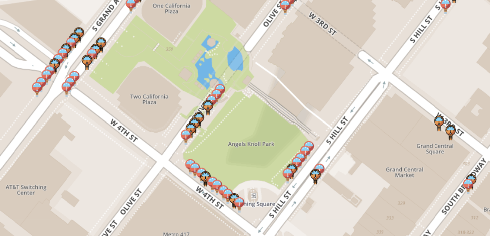

# MeterMeter
A Leaflet map of Los Angeles parking meters and their availability. The application is currently deployed [via Heroku](<http://metermeter.herokuapp.com/>).

Using [occupancy data](<https://data.lacity.org/A-Livable-and-Sustainable-City/Parking-Meter-Occupancy/e7h6-4a3e>) from the LADOT Parking Meters Division hosted by LA's Open Data portal and [static meter data](https://data.lacity.org/A-Livable-and-Sustainable-City/Parking-Meter-Inventory/s49e-q6j2), I was able to create a very lightweight web app usable on mobile. Will consider adapting to a mobile application.

Currently, the meters with occupancy detection are in operation only in downtown Los Angeles, the much-frequented Hollywood area from the Walk of Fame to Hollywood High, and the Westwood area.

LADOT describes the occupancy data as... 

> Last known occupancy state of those City of Los Angeles Parking Meters equipped with occupancy detector sensors. Updated in real-time, as available.   
